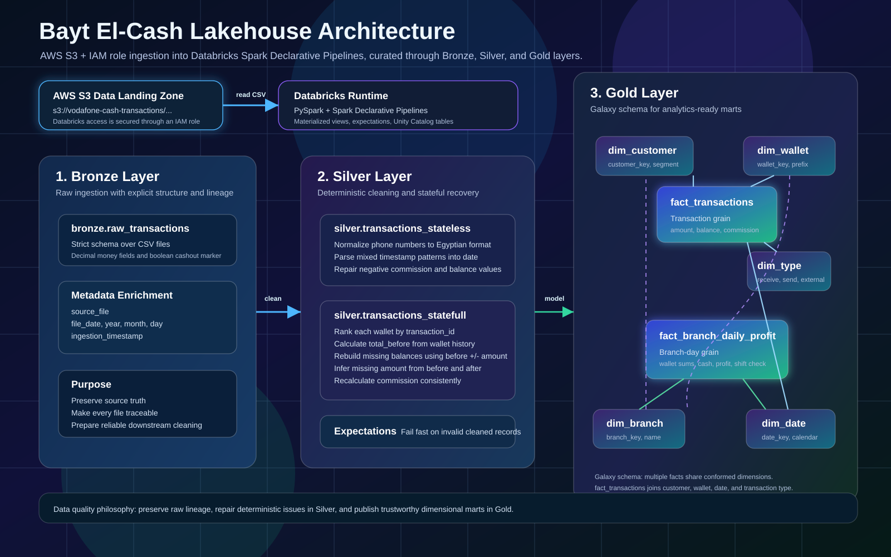
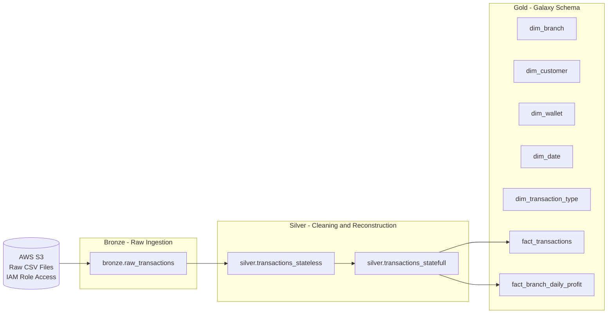

Bayt El-Cash - Vodafone Cash Transactions ETL Pipeline



A production-style Medallion Architecture data pipeline built on Databricks
using PySpark and Spark Declarative Pipelines. The project ingests raw
transaction files from AWS S3, cleans and reconstructs unreliable historical
records, and publishes analytics-ready Gold tables using a Galaxy Schema.

## The Story

Bayt El-Cash is a mobile-wallet services company operating 15 branches across
Alexandria, Egypt, with an 11-year operational history spanning 2015 to 2026.
For much of that period the company had no digital operational system —
branch transactions were recorded manually on paper.

After years of growth, management decided to expand into a new governorate and
digitize the company. Over a decade of historical paper records were entered
into a new software system alongside newer digital transactions. That
migration introduced serious data quality problems across the full 11-year
dataset: missing balances, missing amounts, malformed phone numbers,
inconsistent date formats, negative money values, and broken transaction
sequences.

A data engineer was brought in to design a pipeline that could clean,
reconstruct, validate, and model this data reliably enough to support branch
expansion analytics. This repository documents that pipeline.

## Architecture Overview

The pipeline follows the Medallion Architecture:



| Layer | Databricks Object | Purpose |
| --- | --- | --- |
| Bronze | Delta materialized view | Ingest raw CSV files and preserve source lineage. |
| Silver | Delta materialized views | Standardize, clean, validate, and reconstruct transaction data. |
| Gold | Delta materialized views | Publish a Galaxy Schema for BI and management analytics. |

## Cloud Integration

Raw transaction files live in Amazon S3:

```python
DATA_SOURCE = "s3://vodafone-cash-transactions/outputs/*/*/*.csv"
```

Databricks reads directly from this bucket using an AWS IAM role attached to
the Databricks environment. No static AWS access keys are stored in the code.
This keeps ingestion secure and aligned with cloud data-engineering practices
for Lakehouse workloads.

All tables are registered under Unity Catalog:

```text
sdp_vodafone_cash_catalog
  bronze
    raw_transactions
  silver
    transactions_stateless
    transactions_statefull
  gold
    dim_branch
    dim_customer
    dim_wallet
    dim_date
    dim_transaction_type
    fact_transactions
    fact_branch_daily_profit
```

## Tech Stack

- Databricks
- PySpark
- Spark Declarative Pipelines (`pyspark.pipelines as dp`)
- Spark SQL
- Delta Lake materialized views
- Unity Catalog
- Amazon S3
- AWS IAM Role

## Project Structure

```text
vodafone_cash_project/
  __init__.py
  common/
    __init__.py
    config.py                 # project constants, source path, table names, expectation dictionaries
  bronze/
    __init__.py
    schema.py                 # explicit Bronze StructType schema
    metadata.py               # file lineage and ingestion metadata
    ingestion.py               # bronze.raw_transactions materialized view
  silver/
    __init__.py
    stateless_functions.py    # row-level cleaning functions
    statefull_functions.py    # wallet-sequence reconstruction functions
    clean_data.py              # stateless and stateful Silver materialized views
  gold/
    __init__.py
    gold_expectations.py      # Gold quality expectation dictionaries
    dimensions_tables.py      # conformed dimension builders
    facts_tables.py           # analytical fact builders
    main_gold.py               # Gold materialized views
```

## Raw Transaction Contract

The Bronze layer enforces an explicit schema instead of relying on schema
inference. This is important because the source files contain financial values,
mixed formats, and historical inconsistencies.

Money columns use `DecimalType(18, 2)` to avoid floating point errors.

| Column | Type | Description |
| --- | --- | --- |
| `transaction_id` | Integer | Unique transaction identifier. |
| `transaction_type` | String | Operation type: `receive`, `send`, or `external`. |
| `amount` | Decimal(18,2) | Transaction amount. |
| `customer_phone_number` | String | Customer phone number before standardization. |
| `customer_name` | String | Customer name. |
| `total_balance_after_transaction` | Decimal(18,2) | Wallet balance after the transaction. |
| `timestamp` | String | Raw timestamp string from the source file. |
| `commission` | Decimal(18,2) | Transaction commission. |
| `myphone` | String | Branch wallet number. |
| `branch_name` | String | Branch name. |
| `cash_balance` | Decimal(18,2) | Branch cash snapshot when available. |
| `is_cashout_row` | Boolean | Marker used to interpret wallet state correctly. |

## Bronze Layer - Raw Ingestion

The Bronze layer reads every raw CSV file from S3 with a strict schema and
adds operational metadata.

```python
@dp.materialized_view(name="bronze.raw_transactions")
def raw_transactions():
    df = (spark.read.format("csv")
        .option("header", "true")
        .schema(bronze_schema)
        .load(DATA_SOURCE))
    return add_metadata(df)
```

Bronze adds:

- `source_file`
- `file_date`
- `year`
- `month`
- `day`
- `ingestion_timestamp`

This layer does not drop or repair records. Its job is to preserve source
truth, enforce structure, and make every row traceable back to its original
file.

## Silver Layer - Cleaning and Reconstruction

The Silver layer is where the core engineering work happens. It is split into
two stages because not every data issue can be solved the same way.

### `silver.transactions_stateless`

This stage fixes row-level issues that do not require previous transactions.
It is protected with:

```python
@dp.expect_all_or_fail(STATELESS_RULE)
```

| Function | What it solves |
| --- | --- |
| `get_true_date` | Parses both `yyyy-MM-dd HH:mm:ss` and `dd/MM/yyyy HH:mm:ss`, then produces a clean `date` column. |
| `handel_nagative_values` | Converts negative `commission` and `total_balance_after_transaction` values to their absolute value. |
| `handel_phone_number_format` | Standardizes customer phone numbers from `+20...`, `20...`, and 10-digit local formats into the Egyptian `01xxxxxxxxx` format. |

Example stateless expectations:

- `customer_phone_number RLIKE '^01[0125][0-9]{8}$'`
- `commission >= 0`
- `date IS NOT NULL`
- `date >= '2015-01-01' AND date <= '2026-12-31'`

### `silver.transactions_statefull`

This stage handles sequence-aware recovery. It is protected with:

```python
@dp.expect_all_or_fail(STATEFULL_RULE)
```

The key insight is that wallet transactions form an ordered ledger. For each
wallet, the previous transaction's ending balance can be used to reconstruct
the next transaction's starting balance.

The pipeline uses a Spark window ordered by wallet and transaction:

```python
Window.partitionBy("myphone").orderBy("transaction_id")
```

Core reconstruction functions:

| Function | Role |
| --- | --- |
| `add_ranked` | Adds a deterministic transaction sequence per wallet. |
| `add_total_before` | Reconstructs the balance before each transaction using wallet history, first-transaction logic, and cashout reset handling. |
| `get_true_total_balances` | Fills missing ending balances using `total_before + amount` for `receive` and `total_before - amount` for `send` or `external`. |
| `clean_amount` | Infers missing amounts from the difference between `total_before` and `total_balance_after_transaction`. |
| `get_true_commission` | Recalculates commission deterministically from transaction type and reconstructed amount so the cleaned dataset has consistent commission values. |

This is the strongest part of the pipeline: instead of dropping incomplete
historical records, Silver rebuilds missing values from deterministic
relationships between transaction direction, amount, previous balance, ending
balance, and wallet order.

Example stateful expectations:

- `amount IS NOT NULL`
- `total_balance_after_transaction IS NOT NULL`
- `total_before IS NOT NULL`
- `transaction_type IN ('receive', 'send', 'external')`
- `total_balance_after_transaction <= 200000`
- `total_balance_after_transaction >= 0`

## Gold Layer - Galaxy Schema

The Gold layer models the cleaned Silver data into a Galaxy Schema, also known
as a Fact Constellation Schema. This design is used because the project has two
analytical grains that share conformed dimensions:

- transaction-level analysis
- branch-day performance analysis

## Gold Dimensions

| Table | Grain | Main Columns |
| --- | --- | --- |
| `gold.dim_branch` | One row per branch | `branch_key`, `branch_name` |
| `gold.dim_customer` | One row per customer per branch | `customer_key`, `customer_name`, `customer_phone_number`, `customer_segment`, `branch_key` |
| `gold.dim_wallet` | One row per wallet | `wallet_key`, `wallet_number`, `wallet_prefix`, `branch_key` |
| `gold.dim_date` | One row per date | `date_key`, `full_date`, `day`, `month`, `quarter`, `year`, weekday fields |
| `gold.dim_transaction_type` | One row per transaction type | `transaction_type_key`, `transaction_type` |

Gold dimensions use:

```python
@dp.expect_all_or_drop(...)
```

Invalid dimension rows are filtered out so they do not become analytical
entities.

## Gold Fact Tables

| Fact Table | Grain | Purpose | Shared Dimensions |
| --- | --- | --- | --- |
| `gold.fact_transactions` | One row per transaction | Detailed transaction analysis by customer, wallet, date, and transaction type. | `dim_customer`, `dim_wallet`, `dim_date`, `dim_transaction_type` |
| `gold.fact_branch_daily_profit` | One row per branch per day | Daily management view of branch opening state, closing state, external movement, profit, and shift balance status. | `dim_branch`, `dim_date` |

`fact_transactions` uses `expect_all_or_drop` to keep invalid analytical rows
out of the final mart.

`fact_branch_daily_profit` uses `expect_all_or_fail`, including a critical
`is_true_shift = TRUE` expectation. If the daily branch-level financial view is
not balanced, the pipeline fails instead of publishing unreliable management
metrics.

## Galaxy Schema Relationships

`gold.fact_transactions` joins to:

- `gold.dim_customer` through `customer_key`
- `gold.dim_wallet` through `wallet_key`
- `gold.dim_date` through `date_key`
- `gold.dim_transaction_type` through `transaction_type_key`

`gold.fact_branch_daily_profit` joins to:

- `gold.dim_branch` through `branch_key`
- `gold.dim_date` through `date_key`

Additional conformed relationships:

- `gold.dim_wallet` belongs to `gold.dim_branch`
- `gold.dim_customer` belongs to `gold.dim_branch`

The shared `dim_date` table lets analysts move from branch-level daily
performance to transaction-level detail on the same calendar axis.

## Data Quality Strategy

Every layer declares quality expectations close to the transformation logic.

| Mode | Behavior | Used for |
| --- | --- | --- |
| `expect_all_or_fail` | Stops the pipeline run when expectations fail. | Silver integrity checks and the critical branch daily balance check. |
| `expect_all_or_drop` | Drops rows that fail expectations. | Gold dimensions and transaction fact hygiene. |

This approach makes the pipeline explicit about what is accepted at each stage:
raw records are preserved in Bronze, deterministic repairs happen in Silver,
and only trusted analytical records are published in Gold.

## Running on Databricks

1. Configure Databricks access to the S3 bucket using an AWS IAM role or Unity
   Catalog storage credential pattern.
2. Create or select the Unity Catalog catalog:

   ```sql
   CREATE CATALOG IF NOT EXISTS sdp_vodafone_cash_catalog;
   ```

3. Create the Medallion schemas:

   ```sql
   CREATE SCHEMA IF NOT EXISTS sdp_vodafone_cash_catalog.bronze;
   CREATE SCHEMA IF NOT EXISTS sdp_vodafone_cash_catalog.silver;
   CREATE SCHEMA IF NOT EXISTS sdp_vodafone_cash_catalog.gold;
   ```

4. Upload the project modules to Databricks Repos or Workspace files.
5. Create a Spark Declarative Pipeline and include the Bronze, Silver, and Gold
   pipeline files.
6. Run the pipeline.
7. Review expectation results and materialized view outputs in the Databricks
   pipeline UI.

## Suggested Analytics Use Cases

- Daily branch profit tracking.
- Branch performance comparison across Alexandria.
- Customer segmentation into VIP and Normal customers.
- Wallet usage and wallet prefix analysis.
- Transaction type distribution over time.
- Shift balance monitoring and exception reporting.
- Expansion planning based on historical branch performance.

## Why This Project Matters

This pipeline turns 11 years of unreliable operational records into a trusted
Lakehouse model. It preserves raw lineage, reconstructs missing values through
wallet-level sequence logic, and publishes a clean dimensional model for
decision makers.

The final result is not just a cleaned dataset. It is a repeatable data
engineering system that can support reporting, auditing, and future expansion
analytics.

## Future Enhancements

- Add Auto Loader for incremental cloud file ingestion.
- Add a data quality dashboard for expectation failures.
- Add CI tests for transformation functions.
- Publish BI dashboards on top of the Gold layer.
- Add orchestration alerts for failed critical expectations.
